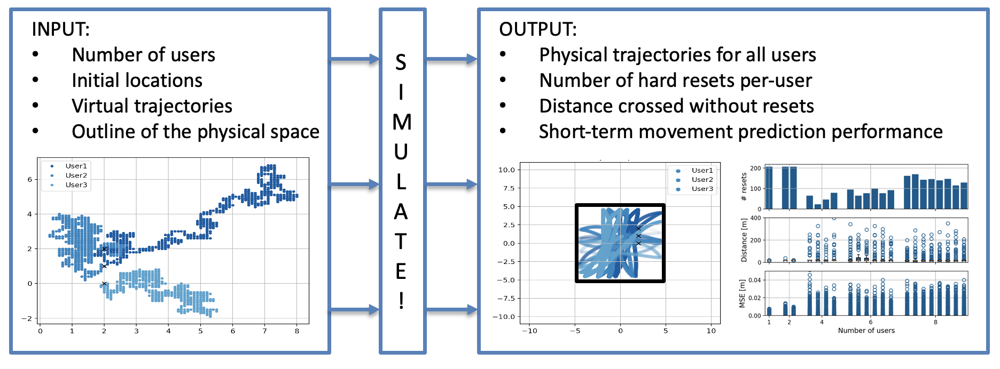

# User Mobility Simulator for Full-Immersive Multiuser Virtual Reality with Redirected Walking #

<div class="align-justify"> Full-immersive multiuser Virtual Reality (VR) applications are envisioned to enable seamless mobility of VR users in the virtual worlds, while simultaneously constraining them inside shared physical spaces through redirected walking. For enabling high data rate and low latency delivery of video content in such setups, the supporting wireless networks will have to utilize highly directional communication links, where these links will have to “track” the mobile VR users for maintaining the Line of Sight (LoS) connectivity. The design decisions about the mobility patterns of the VR users in the virtual worlds will thus have a substantial effect on the mobility of these users in the physical environments, and therefore also on performance of the underlying networks. Hence, there is a need for a tool that can provide a mapping between design decisions about the mobility in the virtual words, and their effects on the mobility in the physical environments. To address this issue, we provide a simulator for enabling this functionality. Given a set of VR users with their virtual movement trajectories, the outline of the physical deployment environment, and a redirected walking algorithm for avoiding physical collisions, the simulator is able to derive the physical movements of the users. Based on the derived physical movements, the simulator can capture a set of performance metrics characterizing the number of perceivably resets and the distances between such resets for each user. The simulator is also able to indicate the predictability of the physical paths, which can serve as an indication of the complexity of supporting a given virtual movement patterns by the underlying networks.</div>



## Requirements

* <a href="https://www.python.org/downloads/release/python-370/">Python 3.7</a>
* Python libraries: <a href="https://numpy.org/">NumPy</a>, <a href="https://matplotlib.org/">Matplotlib</a>, <a href="https://pandas.pydata.org/">Pandas</a>, <a href="https://www.tensorflow.org/learn">TensorFlow</a>.

## Installation

Download the simulator and start it from the main script _simulator.py_. 

```vim
 python simulator.py
```

## Usage Instructions

* Configure the desired set of input parameters in _simulator.py_. 
* Define each VR user with its initial location and virtual trajectory.
* Define if the micro-scale performance metric should be captured using _prediction.make_and_evaluate_predictions_ (see example).

## License

This project is licensed with the  license, meaning that you are free to share and change it, while making sure the software is free for all its users. In addition, we ask you to acknowledge our efforts in any works and publications derived using the project or some of its parts by citing the following paper:

Filip Lemic, Jakob Struye, and Jeroen Famaey: _User Mobility Simulator for Full-Immersive Multiuser Virtual Reality with Redirected Walking_, submitted for publication, 2021 

[](https://zenodo.org/badge/latestdoi/391089467)
